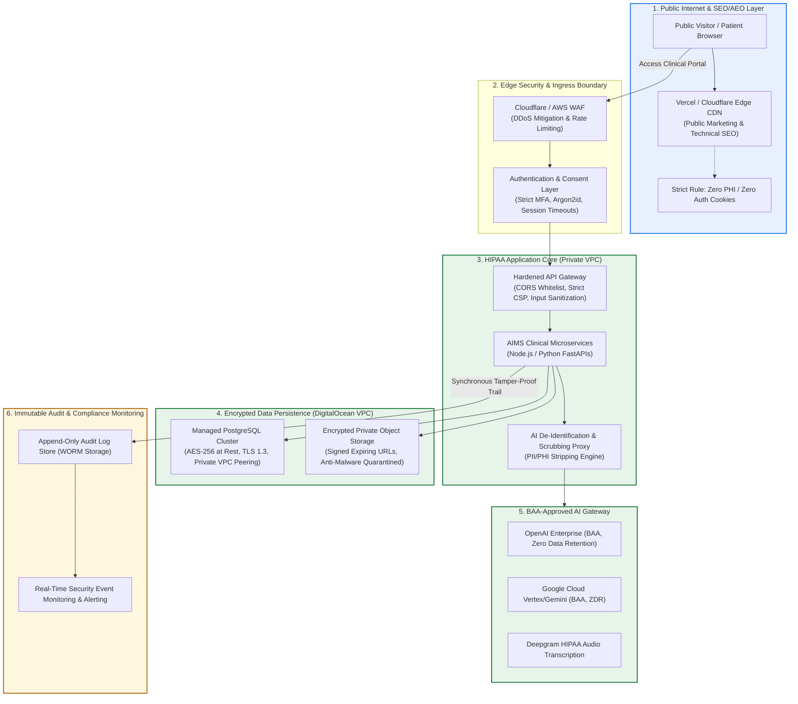

# AIMS Health AI Platform: Executive CTO Architecture & HIPAA Compliance Specification

> **Document Classification:** Confidential & Executive Technical Strategy  
> **Prepared For:** AIMS Executive Leadership & CTO Technical Review  
> **Author:** Antigravity CTO Engineering & Security Specialist  
> **Effective Date:** September 2026  
> **Regulatory Reference:** HHS HIPAA Security, Privacy & Breach Notification Rules (45 CFR Parts 160/164), FDA Clinical Decision Support (CDS) Guidance (Jan 2026), FTC Health Breach Notification Rule  

---

## Executive Summary & Core Framing

HIPAA compliance is **not a feature**, nor is it a checklist item that can be satisfied by a single code commit. It is a comprehensive synthesis of **hardened software engineering, isolated infrastructure, enforceable legal contracts (BAAs), operational policies, and administrative safeguards**.

Under the Health Insurance Portability and Accountability Act of 1996 (HIPAA) and the Health Information Technology for Economic and Clinical Health (HITECH) Act, the Department of Health and Human Services (HHS) mandates that any Covered Entity or Business Associate handling **electronic Protected Health Information (ePHI)** must demonstrate rigorous adherence to three statutory pillars:
1. **Administrative Safeguards (45 CFR § 164.308):** Formal risk management, workforce training, access governance, and vendor contracting.
2. **Physical Safeguards (45 CFR § 164.310):** Data center access controls, device security, workstation use policies.
3. **Technical Safeguards (45 CFR § 164.312):** Access controls, audit controls, data integrity, person/entity authentication, and transmission security.

**Strategic Core Directive:** Close all ePHI vulnerability gaps, enforce zero-trust application boundaries, and sign all vendor BAAs **before** scaling marketing or public-facing SEO.

---

## High-Level System Architecture Topology

The AIMS platform follows a **Strict Separation of Concerns** model. Public crawlable marketing layers are completely decoupled from authenticated clinical systems.



---

## Detailed 17-Domain Technical & Operational Framework

### 1. DigitalOcean Infrastructure & BAA Boundaries
* **HIPAA Scope Definition:** Any DigitalOcean Droplet, Managed Database, Managed Kubernetes (DOKS), or Spaces Object Store that stores, caches, processes, or transmits ePHI is part of the HIPAA boundary.
* **HHS Cloud Computing Guidance:** HHS explicitly affirms that a cloud service provider (CSP) handling encrypted ePHI is still a Business Associate even if the CSP does not possess the decryption keys.
* **Mandatory Controls:**
  * **BAA Execution:** Execute a formal Business Associate Agreement with DigitalOcean covering specific Droplets, VPCs, and Spaces buckets.
  * **VPC Isolation:** Isolate all clinical workloads inside a Private Virtual Private Cloud (VPC). No database or internal microservice may bind to a public IP address (`0.0.0.0/0`).
  * **Least-Privilege Networking:** Restrict inbound traffic strictly to the reverse proxy/ingress controllers via security firewalls.
  * **Environment Partitioning:** Separate accounts and VPCs for Production, Staging, and Development. **Absolute Rule:** Zero real patient data in development or staging environments (use synthetic data generators only).
  * **Automated Encrypted Backups:** Daily encrypted snapshots with automated replication. Documented and biannually tested Disaster Recovery (DR) and Recovery Point Objective (RPO < 1 hour) / Recovery Time Objective (RTO < 4 hours).

---

### 2. Vercel & Edge Hosting Boundary
* **Data Flow Audit:** Determine whether ePHI touches Vercel Edge/Serverless functions, middleware, headers, error logs, or analytics.
* **Enterprise Coverage:** If serverless functions parse intake forms or clinical sessions, Vercel must be enrolled under an Enterprise BAA.
* **Log Redaction:** Configure Vercel runtime log drains to strip request bodies, query strings containing patient parameters, and Authorization headers.
* **Zero Secrets in Client Bundles:** Audit all build configurations to ensure no private keys or database URLs are exposed via `VITE_` or `NEXT_PUBLIC_` variables.
* **Preview Deployment Quarantine:** Configure preview branch deployments to use local mock databases only; strictly prohibit preview branches from binding to production DigitalOcean databases.

---

### 3. GitHub Code Hygiene & Repository Remediation
* **Source Code Exclusivity:** GitHub is strictly for source code and infrastructure-as-code (IaC). Zero ePHI, clinical transcripts, audio recordings, diagnostic exports, database dumps (`.sql`), or customer logs may ever enter the repository.
* **Legacy Upload Remediation:** 
  * Although `.gitignore` now ignores `uploads/` and patient document paths, `.gitignore` does not retroactively remove historical commits.
  * **Immediate Action:** Execute `git-filter-repo` or BFG Repo-Cleaner across all repository branches to permanently purge historical upload artifacts and sensitive fixtures from git history.
* **Enforced Controls:**
  * GitHub Advanced Security Secret Scanning & Push Protection enabled organization-wide.
  * Branch protection rules on `main`: require 2 approving peer reviews, passing SAST/DAST CI checks, and signed commits.
  * Mandatory 2FA/MFA for all organization members.

---

### 4. AI Ecosystem & De-Identification Gateway (OpenAI, Gemini, Deepgram, Anthropic)
* **Comprehensive AI Provider Inventory:**
  * **Google Gemini / Cloud Vertex:** BAA required for multimodal analysis (radiology images, video frames, lesion snapshots).
  * **OpenAI API:** Enterprise BAA with Zero Data Retention (ZDR) clause for clinical NLP summarization.
  * **Deepgram:** Healthcare BAA model for clinical conversational speech-to-text.
* **Minimum-Necessary Data Principle:** Never pass raw identifiers (Name, MRN, Address, Social Security Number, Phone Number) into external LLM prompts.
* **Automated De-Identification Gateway:**
  * Intercept all outbound AI prompts via an internal sanitization proxy.
  * Regex and Named Entity Recognition (NER) tokenization: replace real patient identifiers with synthetic aliases (e.g., `Patient_A9F2`, `Clinician_B4C1`).
* **Zero Model Training:** Ensure contractual stipulations that vendor models never train on prompt content, feedback, or multimodal inputs.

---

### 5. Authentication, Access Governance & Session Security
* **Multi-Factor Authentication (MFA):** Mandatory TOTP / FIDO2 WebAuthn for all clinicians, physicians, and administrative staff. SMS-based MFA is disallowed for staff accounts due to SIM-swap vulnerabilities.
* **Role-Based Access Control (RBAC):** Granular permission sets (`SuperAdmin`, `AttendingPhysician`, `ConsultingSpecialist`, `NursePractitioner`, `BillingClerk`, `PatientUser`).
* **Encounter-Level Scoping:** Clinicians may only view patient records assigned to their active department or active appointment encounter.
* **Automatic Inactivity Timeouts:** Enforce a hard 15-minute inactivity session lock on all clinical consoles and web interfaces.
* **Immediate Revocation Pipeline:** Invalidate active JWTs/sessions instantly upon password change, privilege modification, or employment termination via a Redis-backed token revocation denylist.
* **Password Hashing:** Argon2id with memory cost 64MB and iteration count 3 (or bcrypt cost 12 minimum).

---

### 6. Immutable Audit Logging (The "Anti-Swallow" Directive)
* **HIPAA Security Rule § 164.312(b):** Requires audit controls to record and examine activity in information systems containing or using ePHI.
* **Audit Scope:**
  * ePHI access: Every Read, View, Search, Create, Update, and Delete event.
  * Authentication: Logins, failed login attempts, logouts, password resets, MFA challenges.
  * System Events: Privilege escalations, configuration changes, bulk record exports.
  * AI Events: Timestamp, model version, prompt hash, anonymized token footprint.
* **CRITICAL ARCHITECTURAL RULE (Anti-Swallow):**
  * In many legacy codebases, audit logging is wrapped in a silent `try { log(); } catch (e) {}` block. **This is a direct compliance hazard.**
  * If the audit logging service fails or is unreachable, the transaction **MUST FAIL** or immediately route to a high-priority fallback queue with alert notification. Silent failure of audit logging invalidates clinical defensibility.
* **Tamper-Proof Storage:** Stream logs to Write-Once-Read-Many (WORM) storage (e.g., AWS S3 Object Lock in Compliance Mode) with a minimum 6-year statutory retention schedule.

---

### 7. Secure Application Coding Standards
* **CORS Hardening:** Disallow `Access-Control-Allow-Origin: *`. Production APIs must validate origin headers against an explicit, immutable whitelist of authorized frontend domains.
* **Content Security Policy (CSP):**
  * Eliminate `unsafe-eval` completely.
  * Eliminate `unsafe-inline` by migrating all inline scripts to cryptographic nonces (`nonce-{random}`).
  * Restrict `frame-ancestors` to `'none'` to prevent clickjacking.
* **SQL Injection & ORM Safety:** Use parameterized SQL queries exclusively. Raw string concatenation in database queries is prohibited.
* **File Upload Hardening:**
  * Validate file headers (magic numbers), not just MIME types or extensions.
  * Enforce strict size limits (e.g., 25MB for images, 100MB for video).
  * Isolate uploaded media in a quarantined storage bucket; run automated malware/antivirus scanning (ClamAV) prior to releasing files to clinical view.
* **Endpoint Authorization Check:** Verify ownership on every resource:
  ```typescript
  // REQUIRED: Verify user authorization for the specific record
  if (record.patientId !== req.user.id && !req.user.hasClinicalAssignment(record.patientId)) {
    auditLogSecurityBreachAttempt(req.user.id, record.patientId);
    throw new ForbiddenException("Unauthorized access to protected health record");
  }
  ```

---

### 8. Cryptographic Standards
* **Transmission Security:** TLS 1.3 preferred, TLS 1.2 minimum. Enforce HTTP Strict Transport Security (HSTS) with `max-age=31536000; includeSubDomains; preload`.
* **Storage Encryption:** AES-256 full disk and volume encryption on all DigitalOcean droplets and managed databases.
* **Field-Level Encryption:** Sensitive identifiers (SSN, Insurance ID, full clinical progress notes) encrypted using envelope encryption with AWS KMS or HashiCorp Vault.
* **Key Management:** Centralized key storage with annual automated key rotation protocols.

---

### 9. Patient Consent, NPP & Privacy Disclosures
* **Notice of Privacy Practices (NPP):** Prominently accessible document describing how medical information may be used and disclosed. Mandatory signed electronic acknowledgment upon patient onboarding.
* **Multi-Part Granular Consent Workflow:**
  1. *Informed Consent for Telehealth:* Disclosing technical limitations, risks, and emergency procedures.
  2. *Consent for Clinical Recording:* Explicit authorization to capture audio/video for medical record purposes.
  3. *AI Processing Acknowledgment:* Transparent disclosure that generative AI tools assist clinicians in documentation.
  4. *Communication Preferences:* Separate opt-ins for appointment SMS vs administrative email.
* **Cryptographic Proof of Agreement:** Every consent submission must persist:
  * Document Title and Semantic Version Number.
  * SHA-256 hash of the exact legal text displayed at time of signing.
  * Electronic signature vector, IP address, user-agent, and UTC ISO-8601 timestamp.
  * Ability for patient to revoke consent with an immutable audit trail.

---

### 10. Cookies, Tracking Technologies & HHS Bulletin Compliance
* **Regulatory Reality:** HHS Office for Civil Rights (OCR) bulletins warn that deploying tracking technologies (Meta Pixel, Google Analytics, Hotjar, TikTok Pixel) on authenticated patient portals or health condition pages is a HIPAA violation.
* **Mandatory Architecture:**
  * **Zero 3rd-Party Trackers on Patient Routes:** Strictly prohibit marketing scripts, advertising beacons, and external session replay tools on `/portal/*`, `/intake/*`, `/telehealth/*`, or `/records/*`.
  * **Public Marketing Pages Only:** If privacy-friendly analytics (e.g., self-hosted Plausible) are utilized on public marketing pages, configure them to hash IP addresses and purge referrer strings containing medical search terms.

---

### 11. Telemedicine & Clinical Media Handling
* **Active Recording Safeguards:**
  * Explicit confirmation prompt presented to both patient and provider prior to activating session recording.
  * Prominent, persistent visual indicator (red flashing badge + status banner) throughout the duration of recording.
* **Media Storage Governance:**
  * Video and audio streams must not be stored on unverified third-party consumer media services (e.g., consumer Cloudinary accounts without BAA).
  * Store clinical media in dedicated, encrypted private S3/Spaces buckets.
  * Serve recordings exclusively via short-lived pre-signed URLs (maximum TTL: 15 minutes). Public static URLs are forbidden.
* **Record Retention:** Implement automated lifecycle policies that retain or purge recordings in alignment with state medical board requirements (typically 7 years for adults, age of majority + 7 years for pediatric records).

---

### 12. Clinical Communications (SMS, Email, Push)
* **Vendor BAAs:** Twilio (Healthcare Edition), SendGrid, or AWS SES under an executed BAA.
* **Minimum-Necessary Content:**
  * **Prohibited in SMS/Email:** Lab test results, diagnoses, medication names, symptoms, or doctor consultation notes.
  * **Permitted in SMS/Email:** Generic notification alerts ("You have a new secure message from AIMS Health. Log in to your portal to review: [domain/portal]").

---

### 13. Administrative Safeguards & Workforce Governance
* **Designated Governance:** Appoint a formal HIPAA Security Officer and HIPAA Privacy Officer.
* **Security Risk Analysis (SRA):** Conduct and document a comprehensive annual HIPAA Security Risk Analysis identifying threats, vulnerabilities, likelihood, and impact.
* **Workforce Training:** Mandatory HIPAA and cybersecurity training upon hiring and annually thereafter. Document training completion certificates.
* **Sanctions Policy:** Formal written policy establishing disciplinary actions (up to immediate termination and legal referral) for unauthorized access or snooping into patient records.

---

### 14. Breach Response & Statutory Notification Protocol
* **Incident Response Runbook:** Documented procedures for Detection, Isolation, Forensic Analysis, Containment, and Evidence Preservation.
* **Four-Factor Risk Assessment (45 CFR § 164.402):**
  1. Nature and extent of PHI involved (including identifiers and likelihood of re-identification).
  2. The unauthorized person who used the PHI or to whom the disclosure was made.
  3. Whether the PHI was actually acquired or viewed.
  4. The extent to which the risk has been mitigated.
* **Statutory Notification Timelines:**
  * Notify affected individuals without unreasonable delay and in no case later than **60 calendar days** from discovery.
  * Notify HHS Secretary via OCR reporting portal.
  * If a breach affects **500 or more individuals** in a state, issue a notification to prominent media outlets in that jurisdiction.
* **FTC Rule Coordination:** For direct-to-consumer health tracking features that fall outside traditional covered entity classification, adhere to the FTC Health Breach Notification Rule.

---

### 15. AI Clinical Regulation & FDA CDS Guidance (Jan 2026)
* **Regulatory Distinction:** FDA's Clinical Decision Support (CDS) Software guidance distinguishes software that **merely assists** a healthcare provider from software that **replaces** clinical judgement (which is regulated as a Medical Device / SaMD).
* **Intended Use Statement:**
  * "AIMS is an intelligent clinical workflow and documentation assistant designed to support licensed healthcare practitioners. It does not provide definitive medical diagnoses or autonomous prescription decisions. All clinical recommendations, summaries, and diagnostic suggestions require independent review, validation, and sign-off by a licensed physician."
* **Marketing Copy Sanitation:**
  * **Eliminate:** "AI diagnostic tool for symptoms, lifestyle analysis, and medical treatment."
  * **Adopt:** "Clinical intake documentation assistant and decision-support workflow platform for medical practices."
* **Clinical Interpretability:** The AI gateway must preserve and present the clinical rationale and authoritative source citations to the attending physician to satisfy the Non-Device CDS transparency criteria.

---

### 16. Public Landing Page Legal Infrastructure
* **Required Legal Trust Center:**
  * Global footer links on every public page:
    * Notice of Privacy Practices (NPP)
    * Terms of Service (ToS)
    * Website Privacy Policy
    * Patient Rights & Responsibilities
    * Cookie & Privacy Preferences
    * Accessibility Statement (WCAG 2.1 Level AA)
  * Corporate identity: Legal entity name, registered office address, and Medical Director credentials.

---

### 17. SEO & AI Search Optimization (AEO) Strategy
* **Strict Boundary Isolation:**
  * Public marketing and educational pages are indexed and optimized for search engines.
  * Clinical routes, intake links, patient dashboards, and appointment links are **strictly non-indexable**:
    * `robots.txt`:
      ```
      User-agent: *
      Disallow: /portal/
      Disallow: /intake/
      Disallow: /telehealth/
      Disallow: /api/
      Disallow: /records/
      ```
    * HTTP Response Header: `X-Robots-Tag: noindex, nofollow, noarchive` on all authenticated views.
* **Public Technical SEO:**
  * Unique `<title>` and `<meta name="description">` per page.
  * Canonical URLs on all public routes.
  * JSON-LD Structured Data: `Organization`, `SoftwareApplication`, and `MedicalWebPage`.
  * High-performance Core Web Vitals (LCP < 2.5s, CLS < 0.1, INP < 200ms).
* **AI Engine Optimization (AEO / Answer Engine Readiness):**
  * Clear factual pages detailing how AIMS accelerates healthcare practice workflows.
  * Structured FAQ schema answering common clinical automation inquiries.
  * Author attribution for health education articles with cited medical literature.
  * Explicit "Last Reviewed / Updated" timestamps.

---

## Actionable Meeting Implementation Roadmap

| Phase | Milestone / Deliverable | Target Timeline | Technical Owner |
| :--- | :--- | :--- | :--- |
| **Phase 1: Legal & Cloud Foundation** | Execute DigitalOcean, OpenAI, and Deepgram BAAs; isolate VPC. | Immediate (Pre-Launch) | Lead DevOps / Legal |
| **Phase 2: Codebase Remediation** | Run `git-filter-repo` to purge historical uploads; enforce CORS whitelist & CSP. | Week 1 | Senior Security Eng |
| **Phase 3: Gateway & Audit Core** | Implement AI De-Identification proxy; refactor audit logger with anti-swallow rules. | Week 2 | Backend Lead |
| **Phase 4: Regulatory & Copy Polish** | Update landing page marketing copy to align with FDA CDS guidelines; add legal footer. | Week 3 | Product / Frontend |
| **Phase 5: Pen-Test & Launch Audit**| Conduct third-party penetration test, automated SAST scan, and HIPAA Risk Analysis. | Week 4 | Third-Party Auditor |

---

## Verification & Acceptance Criteria

1. **BAA Verification:** All infrastructure and AI vendors have signed BAAs on file.
2. **Network Isolation:** DigitalOcean DB accepts zero connections from public IPs; accessible only via private VPC.
3. **Repository Cleanliness:** GitHub repository contains zero files in `uploads/` and zero historical references to patient records.
4. **Audit Integrity:** Disconnecting the audit log store causes intentional API failure with alert generation; zero silent swallowing.
5. **No Tracker Leakage:** Network inspection of `/portal/` verifies zero packets transmitted to Google, Meta, or unauthorized third parties.
6. **Regulatory Alignment:** Public marketing copy contains zero unapproved diagnostic claims, fully adhering to FDA CDS Non-Device guidelines.
