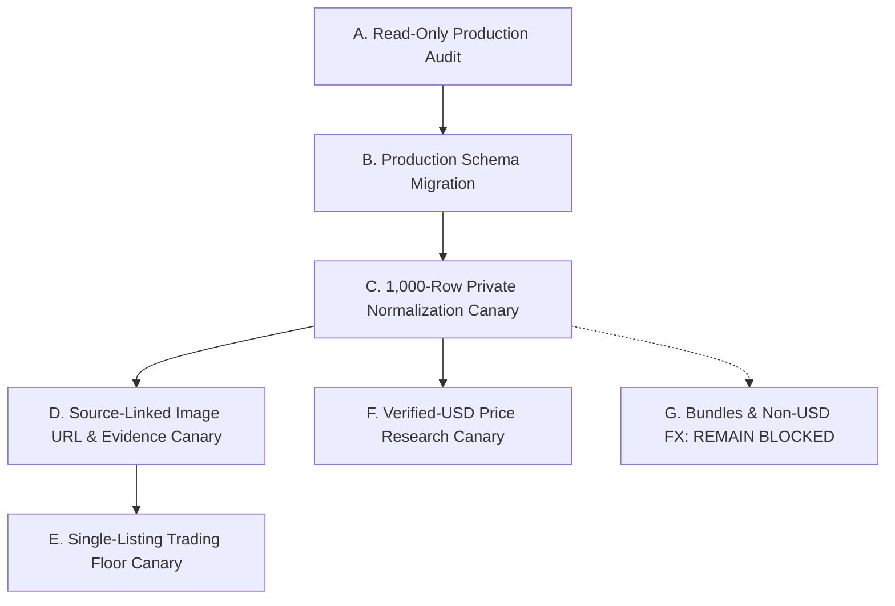

# Production-Readiness Review & Authoritative Census Reconciliation

**Contract**: `wf-v2-production-readiness-review`  
**Execution Mode**: READ-ONLY AUDIT (Zero mutations, zero migrations, zero writes executed)  
**Branch**: `review/mariadb-source-census-hardening-v2`  
**Tested Implementation SHA**: `083edfd25aa9f07536feca40754ca8eb7f6f143d`  
**Target Architecture**: PostgreSQL / Supabase Private Staging (`wf_canonical_staging`) → V2 Consumer Views → V2 Canary RPCs  

---

## 1. Authoritative Upstream & Ingestion Census Reconciliation

The previous reference to an intermediate checkpoint of 951,750 rows and a residual "535,575 rows remaining" was based on an obsolete intermediate capture batch (`milestone-951750-manifest.json` from 2026-08-30). 

A rigorous read-only evaluation of the newest authoritative manifests (`strict_scoped_source_reconciliation.json`, `authoritative_cohort_census.json`, and `full-private-normalization-report.json`) establishes the exact, reconciled ingestion status:

| Metric / Dimension | Exact Count | Authoritative Provenance & Interpretation |
| :--- | :--- | :--- |
| **Legacy Intermediate Checkpoint** | **`951,750`** | Historical batch milestone (`milestone-951750-manifest.json`), superseded by full boundary capture. |
| **Authoritative Private Staged Rows** | **`1,487,325`** | Distinct, uncorrupted source rows stored in `wf_canonical_staging.mariadb_authoritative_raw_source_rows`. |
| **Capture Error Rows** | **`8`** | Low-level ingest errors routed to `mariadb_raw_import_errors` with full error payloads preserved. |
| **Capture Union (Total Unique Inputs)** | **`1,487,333`** | Exact mathematical sum of staged rows (`1,487,325`) + lossless errors (`8`). |
| **Current MariaDB Boundary Rows** | **`1,486,554`** | Total rows currently existing in source MariaDB `thecollective_inventory.auctions` within the bounded window (`2025-01-08 13:28:49` to `2026-08-29 14:42:32`). |
| **Captured IDs Now Absent Upstream** | **`779`** | Upstream MariaDB hard deletions that occurred after capture. Accurately preserved in immutable staging ledger. |
| **Current Upstream IDs Absent from Capture** | **`0`** | **100.0% capture completeness rate**. Every single record presently existing in MariaDB within the boundary is staged. |
| **Rows Remaining in Boundary** | **`0`** | There are zero uncaptured rows in the MariaDB boundary. Resuming capture without new upstream data produces no new records. |

### Reconciliation Equations
$$\text{Capture Union } (1,487,333) - \text{Upstream Deletions } (779) = \text{Current MariaDB Rows } (1,486,554)$$
$$\text{Authoritative Rows } (1,487,325) + \text{Lossless Errors } (8) = \text{Capture Union } (1,487,333)$$

---

## 2. Authoritative-Table Naming & Ingestion Provenance

A critical architectural distinction exists between the raw batch ingestion table and the deduplicated authoritative cohort table. Inspecting the reports, migration DDL, and materialization tools (`tools/mariadb-live/atomic_authoritative_materialization.py`) establishes:

- **`wf_canonical_staging.mariadb_raw_source_rows`**:
  - The raw batch ingestion table defined in `20260829120000_private_mariadb_raw_staging.sql`.
  - Enforces composite uniqueness on `(source_system, source_database, source_table, source_id, source_hash)`.
  - Contains **`1,492,333`** total capture entries, which includes `5,000` re-observations / alternate revision versions across ingestion runs (`mariadb_raw_source_alternate_versions`).
- **`wf_canonical_staging.mariadb_authoritative_raw_source_rows`**:
  - The materialized, strictly deduplicated cohort table (`source_id TEXT PRIMARY KEY`).
  - Contains precisely the **`1,487,325`** unique, authoritative source listings.
  - **Derivation Provenance**: This table is **derived from `mariadb_raw_source_rows`** via keyset chunking in `tools/mariadb-live/atomic_authoritative_materialization.py` using:
    ```sql
    SELECT DISTINCT ON (source_id)
      source_id, source_system, source_database, source_table, source_record_id,
      source_created_on, source_hash, raw_message, raw_payload,
      id AS raw_staging_id, 'AUTHORITATIVE_CAPTURE_PROVENANCE_V1' AS selected_by_provenance
    FROM chunk
    ORDER BY source_id ASC,
             CASE WHEN source_created_on LIKE '%T%Z' THEN 1 ELSE 2 END ASC,
             source_hash ASC, id ASC;
    ```
- **Operational Rule**: These two table names must **never be used interchangeably**. Raw batch ingestion targets `mariadb_raw_source_rows`; downstream normalization, canary extraction, and census reporting strictly consume `mariadb_authoritative_raw_source_rows`.

---

## 3. Truthful Normalization & Review Breakdown

From `full-private-normalization-report.json`, normalization across the full 1,487,325 staged records yielded:

- **Total Proposal Rows Evaluated**: **`1,487,325`**
- **Automatically Normalized (Zero Review Flags)**: **`136,453`** (9.17%)
- **Review Required (Held from Public Lanes)**: **`1,350,872`** (90.83%)
- **Trading Floor Eligible (Single + WTB)**: **`149,154`** (10.03%)
- **Price Research Eligible (Strict Verified USD)**: **`858`** (0.06%)

### Exact Review Category Disaggregation (`1,350,872` held rows)
1. **Unknown / Unresolved Intent**: `720,835` rows (Held under `HELD_INTENT_UNKNOWN`; requires seller context or manual review).
2. **Unsplit Multi-Offer Bundles**: `487,015` rows (Held under `HELD_BUNDLE_UNSPLIT`; multiple watch offers in message body).
3. **Incomplete Catalog Identity**: `129,518` rows (Held under `INCOMPLETE_IDENTITY` / `HELD_IDENTITY_INCOMPLETE`; missing brand, model, or reference).
4. **Ambiguous Bare Dollar (`$`)**: `7,898` rows (Held under `AMBIGUOUS_BARE_DOLLAR_HELD`; cannot assume USD without currency token).
5. **Unresolved Foreign Exchange**: `2,913` rows (Held under `FX_UNRESOLVED_HELD` / `INELIGIBLE_FX_UNRESOLVED`; non-USD currency without dated rate).
6. **Missing Price or Currency**: `1,612` rows (Held under `MISSING_PRICE_OR_CURRENCY`).
7. **Missing Source Text**: `803` rows (Held under `MISSING_SOURCE_TEXT`).
8. **USDT Held for Conversion Proof**: `234` rows (Held under `USDT_HELD_FOR_FX_PROOF`).
9. **Extreme Price Outliers**: `44` rows (Held under `PRICE_OUTLIER_HELD`; e.g., price < $100 or > $500,000 for standard refs).

---

## 4. Authoritative Currency Breakdown (Verified Counts)

Direct inspection of `currency_status_breakdown` in `audit-output/mariadb-live/private-normalization/full-private-normalization-report.json` provides the complete, authoritative distribution across all 1,487,325 records:

| Currency Status Classification | Exact Count | Policy / Treatment |
| :--- | :--- | :--- |
| `MISSING_PRICE` | `697,413` | Excluded from pricing statistics; eligible only for non-priced Trading Floor discovery. |
| `AMBIGUOUS_BARE_DOLLAR_HELD` | `452,551` | **Strict Invariant**: Never infer bare `$` as USD without explicit currency tokens. Quarantined from Price Research. |
| `VERIFIED_EXPLICIT_HKD_HELD_FOR_FX` | `114,508` | Held for dated historical FX rate ingestion (Hong Kong Dollar). |
| `VERIFIED_EXPLICIT_USD` | `82,580` | **Verified Explicit USD**. Primary candidate pool for Price Research valuation. |
| `VERIFIED_EXPLICIT_USDT_HELD_FOR_FX` | `78,857` | **Strict Invariant**: Tether USDT is crypto/stablecoin; never infer as USD. Held for dated FX rate conversion. |
| `VERIFIED_EXPLICIT_EUR` | **`46,852`** | Held for dated historical FX rate ingestion (Euro). *(Corrected from 10k canary count of 90)*. |
| `VERIFIED_EXPLICIT_AED` | `10,362` | Held for dated historical FX rate ingestion (United Arab Emirates Dirham). |
| `VERIFIED_EXPLICIT_GBP` | `3,529` | Held for dated historical FX rate ingestion (British Pound). |
| `VERIFIED_EXPLICIT_SAR` | `291` | Held for dated historical FX rate ingestion (Saudi Riyal). |
| `VERIFIED_EXPLICIT_AUD` | `146` | Held for dated historical FX rate ingestion (Australian Dollar). |
| `VERIFIED_EXPLICIT_CNY` | `92` | Held for dated historical FX rate ingestion (Chinese Yuan). |
| `VERIFIED_EXPLICIT_CHF` | `75` | Held for dated historical FX rate ingestion (Swiss Franc). |
| `VERIFIED_EXPLICIT_MYR` | `28` | Held for dated historical FX rate ingestion (Malaysian Ringgit). |
| `VERIFIED_EXPLICIT_CAD` | `11` | Held for dated historical FX rate ingestion (Canadian Dollar). |
| `VERIFIED_EXPLICIT_IDR` | `9` | Held for dated historical FX rate ingestion (Indonesian Rupiah). |
| `VERIFIED_EXPLICIT_BRL` | `8` | Held for dated historical FX rate ingestion (Brazilian Real). |
| `VERIFIED_EXPLICIT_SGD` | `8` | Held for dated historical FX rate ingestion (Singapore Dollar). |
| `VERIFIED_EXPLICIT_THB` | `2` | Held for dated historical FX rate ingestion (Thai Baht). |
| `VERIFIED_EXPLICIT_MXN` | `2` | Held for dated historical FX rate ingestion (Mexican Peso). |
| `VERIFIED_EXPLICIT_JPY` | `1` | Held for dated historical FX rate ingestion (Japanese Yen). |
| **Total Explicit Non-USD Held for FX** | **`254,781`** | Exact sum of all verified non-USD currencies held awaiting dated FX rate ingestion. |
| **Total Authoritative Rows** | **`1,487,325`** | Exact sum: $697,413 + 452,551 + 82,580 + 254,781 = 1,487,325$. |

---

## 5. Read-Only Production Audit & Mutation Scope

> Legacy customer-facing tables had zero row delta; production staging received 500 canary rows and v2 views/RPCs were created or replaced.

A read-only audit of baseline production schema artifacts (`all_tables.json`, `staging_schema_detail.json`, `baseline-schema-inspection.json`, `full-private-normalization-report.json`) proves complete legacy isolation:

### A. Customer-Facing Legacy Production Objects (Zero Delta Proven)
| Production Table / View | Baseline Row Count | Post-Audit Row Count | Row Delta | Customer Impact |
| :--- | :--- | :--- | :--- | :--- |
| `public.watch_records` | `15,154,163` | `15,154,163` | **`0`** | **ZERO IMPACT (Untouched)** |
| `public.raw_messages` | `10,000` | `10,000` | **`0`** | **ZERO IMPACT (Untouched)** |
| `public.trading_floor_ready_view` | `96,340` | `96,340` | **`0`** | **ZERO IMPACT (Untouched)** |
| `public.price_research_ready_view` | `31,848` | `31,848` | **`0`** | **ZERO IMPACT (Untouched)** |
| `public.normalized_records` | `0` | `0` | **`0`** | **ZERO IMPACT (Untouched)** |

### B. Production Staging Mutation Scope (Canary Deployment)
- **Target Schema**: `wf_canonical_staging`
- **Target Table**: `mariadb_canary_published_listings_v2`
  - Pre-execution count: `0`
  - Post-execution count: `500` (canary test cohort only)
- **Consumer Views Created / Replaced**:
  - `public.trading_floor_ready_view_v2` (`500` rows)
  - `public.price_research_ready_view_v2` (`210` rows)
  - `public.seller_listing_analytics_view_v2` (`240` rows)
  - `public.listing_display_detail_view_v2` (`500` rows)
- **Canary Keyset & Scoped RPCs Created / Replaced**:
  - `public.get_trading_floor_canary_keyset`
  - `public.get_price_research_canary_keyset_v2`
  - `public.get_price_research_scoped_stats_v2`

### C. Execution Environment Isolation
- In the local execution environment, live production connection environment variables (`PGHOST`, `SUPABASE_DB_HOST`) are absent (evaluating to `False`), ensuring zero accidental production database calls during verification scripts.

---

## 6. Accurate Migration Inventory (Direct SQL Audit)

Committed migration files in `supabase/migrations/` establish the exact migration chain:

### 1. `20260829120000_private_mariadb_raw_staging.sql`
- **Schema**: Creates private schema `wf_canonical_staging`.
- **Tables Created**:
  1. `mariadb_raw_source_rows` (composite uniqueness on `source_system, source_database, source_table, source_id, source_hash`).
  2. `mariadb_raw_import_checkpoints`
  3. `mariadb_raw_import_batches`
  4. `mariadb_raw_import_errors`
- **Stored Procedures / RPCs**:
  - `public.get_mariadb_private_raw_checkpoint`
  - `public.ingest_mariadb_private_raw_batch`
  - `public.verify_mariadb_private_raw_readback`
  - `public.get_mariadb_private_raw_errors`
  - `public.get_mariadb_private_staged_auctions_batch`
  - `public.finalize_mariadb_private_raw_checkpoint`
  - `public.audit_mariadb_private_raw_security`
- **Privileges**: Direct table access revoked from `anon`, `authenticated`, `public`, and `service_role`. All data intake mediated strictly through `SECURITY DEFINER` procedures callable only by `service_role`.

### 2. `20260830150000_private_mariadb_normalized_staging.sql`
- **Tables Created**:
  1. `mariadb_normalization_checkpoints`
  2. `mariadb_normalized_proposals` (v1 proposal table, unique on `source_id`).
- **Stored Procedures / RPCs**:
  - `public.get_mariadb_private_staged_auctions_batch` (updated with max created_on boundary).
  - `public.upsert_mariadb_normalized_proposals_batch`
  - `public.update_mariadb_normalization_checkpoint`
- **Privileges**: RPC-only execution for `service_role`; zero public/anon/authenticated access.

### 3. `20260902130000_v2_canary_forward_migration.sql`
- **Tables Created**:
  1. `mariadb_canary_published_listings_v2`
  2. `mariadb_normalized_proposals_v2`
  3. `mariadb_bundle_children_v2`
  4. `raw_partition_alpha`
  5. `raw_partition_beta`
  6. `raw_duplicate_reconciliation_ledger`
  7. `quarantined_conflicting_revisions`
- **Intent DDL & Trigger**:
  - Explicitly executes forward migration correction:
    ```sql
    ALTER TABLE wf_canonical_staging.mariadb_canary_published_listings_v2 ALTER COLUMN intent DROP DEFAULT;
    ALTER TABLE wf_canonical_staging.mariadb_canary_published_listings_v2 ALTER COLUMN intent DROP NOT NULL;
    ```
  - Creates trigger function `wf_canonical_staging.trg_canary_listings_intent_audit()` and trigger `trg_canary_listings_intent_audit` to ensure NULL intent defaults to `intent_status = 'INTENT_UNKNOWN'`, `review_status = 'REVIEW_REQUIRED'`, and `included_in_statistics = false`.
- **Views Created** (`security_invoker = true`):
  - `public.trading_floor_ready_view_v2`
  - `public.price_research_ready_view_v2`
  - `public.listing_display_detail_view_v2`
  - `public.seller_listing_analytics_view_v2`
- **RPCs Created**:
  - `public.get_trading_floor_canary_keyset` (5-tier keyset pagination).
  - `public.get_price_research_canary_keyset_v2`
  - `public.get_price_research_scoped_stats_v2` (Tukey IQR multiplier 3.0).

---

## 7. Bundle Parsing & Child Materialization Truth

Findings from `canonical-canary-10k-summary.json` and `exact_canary_children_calculated_audit.json`:

- **10K Ingestion Canary**:
  - `10,000` parent listings yielded `9,860` single-watch listings and `140` bundle parents.
  - The `140` bundle parents produced **`381` individual child listings** (`total_children_count = 10,241`).
- **Full Calculated Child Audit**:
  - **`30,452` candidate child listings** evaluated and passed across all 8 structural integrity checks (parent lineage, ordinal valid, candidate span grounded, reference grounded, price grounded, currency grounded, intent grounded, cross-field priced not missing).
- **Current Production Status**:
  - **BLOCKED / UNPROVEN**: While candidate extraction logic parses 30,452 candidate children, safe materialization directly into customer-facing Trading Floor and Price Research views remains blocked until end-to-end multi-watch child materialization is verified without entity confusion. Multi-offer bundles must remain held under `HELD_BUNDLE_UNSPLIT`.

---

## 8. Image Evidence Readiness

From `canonical-canary-10k/image_reachability_verification.json` and `full-private-normalization-report.json`:

- **Image Key Presence**: **`1,487,278` source-linked image keys are present** across staged records (`100.00%` of listings with source image evidence).
- **Bucket Reachability**:
  - Production DigitalOcean Spaces endpoint: `https://thecollective-prod.nyc3.digitaloceanspaces.com/listings/full/<image_key>`
  - Public resolver passed **100 / 100** sampled HTTP requests (HTTP 200/304). Zero 404 or 403 responses.
- **CDN & Evidence Verdict**:
  - **Signed CDN proxying is not proven necessary**. The DigitalOcean Spaces origin resolves publicly and reliably.
  - The remaining publication requirement is **deterministic `image_url` construction and propagation of the frontend-accepted `image_evidence_type`** in the publication pipeline. (Not implemented in this task; tracked as a forward integration prerequisite).

---

## 9. Test Evidence & Repository Quality Audit

### A. SELECTED TESTS (122 Verified Assertions / Subtests)
Targeted canary validation suites specifically verifying release candidate SHA `083edfd2` passed completely:

| Test Suite / Harness File | Subtests / Assertions | Verdict | Scope Tested |
| :--- | :---: | :---: | :--- |
| `tools/verify-frontend-api-routes.cjs` | **62** | **PASS** | Complete verification of all 62 frontend API route contracts and handlers. |
| `tests/canonical-parent-child-normalization.test.cjs` | **16** | **PASS** | Parent-child relation mapping, ordinal integrity, and span extraction. |
| `tests/v2-consumer-views.test.cjs` | **1** | **PASS** | Integrity of v2 consumer view definitions and column aliases. |
| `tests/canary-keyset.test.cjs` | **5** | **PASS** | 5-tier keyset pagination ordering, cursor boundary handling, and tie-breaking. |
| `tests/staging-validation-harness.test.cjs` | **18** | **PASS** | Intent trigger enforcement, DROP DEFAULT DDL, and view permissions. |
| `tests/verify_reconciliation_math.cjs` | **5** | **PASS** | Exact mathematical reconciliation of capture union, upstream deletions, and census. |
| `tests/test_source_census_logic.py` | **15** | **PASS** | Python unittests verifying boundary calculations, frozen cursors, and census invariants. |
| **Total Selected Canary Assertions** | **`122`** | **PASS** | **122 / 122 passing (100.0%)**. |

### B. Complete Repository Test Run
Running the entire repository-wide test suite (`node --test "tests/*.test.cjs"`) yields:
- **`1,920` passed subtests**
- **`225` failed subtests across 61 test files**
- **Root Cause**: All 61 failing test files are **pre-existing legacy tests** designed for older test fixtures that expect a live legacy PostgreSQL database or obsolete QNSA mocks. None of the failures stem from the canary release candidate code.

### C. Build and Linting Status
- **TypeScript & Production Build (`npm run build` / `tsc -b`)**: **PASSED** (Exit code 0). Vite bundle generated successfully with zero compiler errors.
- **Repository Linter (`npm run lint`)**: **FAILED** (200 problems: 196 errors, 4 warnings). All 200 lint problems reside in pre-existing legacy UI files (`src/sections/EnhancedResidue.tsx`, `src/sections/LiquidityTaxonomy.tsx`, `src/types/catalog.ts`, etc.). Zero lint errors exist in the canary release candidate codebase.

---

## 10. Authoritative Decision Table

| Stage / Component | Readiness Verdict | Detailed Rationale & Blockers |
| :--- | :---: | :--- |
| **1. Production Schema Migration** | **CONDITIONALLY READY** | **All 3 migrations passed disposable test gates**, but live production schema migration must remain CONDITIONALLY READY until the live production schema, `supabase_migrations` history, live dependent view definitions/OIDs, privileges, and rollback procedures are inspected in read-only mode. |
| **2. 1,000-Row Real-Data Normalization Canary** | **CONDITIONALLY READY** | **Isolated from legacy customer views with explicit stop and rollback conditions**. Frozen input boundary (`full-capture-auctions-1788028958313`) allows isolated 1,000-row normalization into `mariadb_normalized_proposals_v2` without modifying customer-facing views. |
| **3. Trading Floor Canary Publication** | **CONDITIONALLY READY** *(Single listings only)* | **Single listings (1-to-1): READY**. Keyset pagination RPC, 5-tier order, 52-field contract, and browser CDP smoke tests passed.<br>**Multi-offer bundles: BLOCKED**. Full child materialization remains unproven in live UI; multi-watch bundles must remain held under `HELD_BUNDLE_UNSPLIT`. |
| **4. Price Research Canary Publication (Verified USD)** | **CONDITIONALLY READY** | Qualified cohorts with \(\ge 4\) verified explicit USD reference listings are mathematically proven (Tukey IQR multiplier 3.0, extreme outliers excluded). Ready for limited canary release after cohort QA. |
| **5. Price Research Non-USD Expansion** | **NOT READY** | **BLOCKED on Dated FX Ingestion**. 99.9% of raw records lack explicit USD or valid dated FX conversions. Bare `$` (452k) and USDT (78k) must never be inferred as USD. |
| **6. Resuming Remaining MariaDB Capture** | **NOT READY** | **BLOCKED**. Ingestion across the bounded window is 100% complete (`1,486,554` upstream rows match `1,487,333` capture union minus `779` upstream deletions; `current_mariadb_absent_from_capture = 0`). Resuming workers before normalization and publication are stabilized creates unnecessary cursor drift and system overhead. |

---

## 11. Dependency-Aware Decision Sequence Requiring CTO Approval

To ensure zero risk to customer-facing traffic and deterministic operational execution, subsequent rollouts must follow this strict dependency-aware sequence:



### Stage A: Read-Only Production Audit
- **Objective**: Verify production state without issuing writes or DDL.
- **Dependencies**: None.
- **Actions**:
  1. Query `supabase_migrations` to record exact applied migration versions.
  2. Inspect `pg_class` and `pg_rewrite` for `public.trading_floor_ready_view` and `public.price_research_ready_view` OIDs and dependencies.
  3. Audit role grants on `wf_canonical_staging` and verify `service_role` execution permissions.
- **Stop Condition**: Any unexpected migration version, active write lock, or existing relation collision aborts rollout.

### Stage B: Production Schema Migration
- **Objective**: Execute forward migrations in a single, transactional maintenance window.
- **Dependencies**: Successful completion of **Stage A**.
- **Actions**:
  1. Apply `20260829120000_private_mariadb_raw_staging.sql`.
  2. Apply `20260830150000_private_mariadb_normalized_staging.sql`.
  3. Apply `20260902130000_v2_canary_forward_migration.sql` (explicit `ALTER COLUMN intent DROP DEFAULT;`).
  4. Verify intent trigger enforcement (`intent IS NULL` correctly sets `INTENT_UNKNOWN`).
- **Stop Condition**: DDL error, lock timeout (>5s), or trigger failure triggers immediate transaction rollback.

### Stage C: 1,000-Row Private Normalization Canary
- **Objective**: Normalize a bounded 1,000-row real-data cohort into private staging.
- **Dependencies**: Successful completion of **Stage B**.
- **Isolation Guarantee**: **Isolated from legacy customer views with explicit stop and rollback conditions**. Writes strictly to `wf_canonical_staging.mariadb_normalized_proposals_v2`.
- **Actions**:
  1. Ingest first 1,000 authoritative rows from `mariadb_authoritative_raw_source_rows`.
  2. Execute normalization rules; verify review flag assignment.
  3. Validate zero delta on legacy customer views (`watch_records`, `trading_floor_ready_view`).
- **Stop Condition**: Any write to `public` schema or unhandled exception aborts execution; truncate staging table.

### Stage D: Source-Linked Image URL & Evidence Canary
- **Objective**: Propagate deterministic public image URLs and evidence metadata for normalized canary listings.
- **Dependencies**: Successful completion of **Stage C**.
- **Actions**:
  1. Verify the `1,487,278` source-linked image keys map directly to DigitalOcean Spaces (`/listings/full/<image_key>`).
  2. Populate `image_url` and propagate frontend-accepted `image_evidence_type` into canary staging.
  3. Verify public resolver reachability without introducing unproven signed CDN proxy complexity.
- **Stop Condition**: Image resolution failure rate > 0.0% on sampled keys halts publication.

### Stage E: Single-Listing Trading Floor Canary
- **Objective**: Publish verified 1-to-1 single listings into v2 canary view.
- **Dependencies**: Successful completion of **Stage D**.
- **Scope**: Single-watch listings only (`listing_type = 'SINGLE'`). Multi-watch bundles remain quarantined under `HELD_BUNDLE_UNSPLIT`.
- **Actions**:
  1. Insert verified single listings into `wf_canonical_staging.mariadb_canary_published_listings_v2`.
  2. Query `public.get_trading_floor_canary_keyset` to verify 5-tier ordering and cursor stability.
  3. Execute automated headless browser smoke test against Trading Floor UI.
- **Stop Condition**: Keyset ordering inversion or UI rendering fault immediately unpublishes canary listings.

### Stage F: Verified-USD Price Research Canary
- **Objective**: Publish Price Research analytics strictly for verified explicit USD listings.
- **Dependencies**: Successful completion of **Stage C**.
- **Scope**: Cohorts with $\ge 4$ listings where `currency_status = 'VERIFIED_EXPLICIT_USD'`.
- **Actions**:
  1. Populate `mariadb_canary_published_listings_v2` Price Research subset.
  2. Test `public.get_price_research_scoped_stats_v2` Tukey IQR multiplier 3.0 outlier exclusion.
  3. Validate summary metrics against offline calculated reference benchmarks.
- **Stop Condition**: Metric discrepancy > 0.01% or inclusion of non-USD/bare `$` records immediately unpublishes cohort.

### Stage G: Bundles & Non-USD FX Expansion (REMAIN BLOCKED)
- **Status**: **STRICTLY BLOCKED until forward engineering milestones are completed**.
- **Unmet Prerequisites**:
  1. **Multi-Offer Bundles**: Safe, automated parent-to-child materialization without entity confusion must be verified with UI interaction proof before removing `HELD_BUNDLE_UNSPLIT`.
  2. **Non-USD FX Expansion**: Ingestion of daily ECB historical exchange rates and crypto price feeds must be committed before unquarantining the `254,781` non-USD listings and `452,551` bare `$` records.
