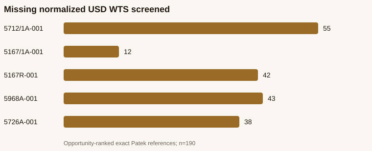

# WATCHFACTS Phase 6A — Patek Philippe Second-Brand Pilot

## Technical summary

**Recommendation: `BLOCKED_NO_SAFE_COHORT`.** The read-only census found 126,571 active Patek staging listings. Parser-v5 screened 190 immutable, single-watch WTS rows with missing normalized USD across five opportunity-ranked exact references and found **0 SAFE**, **162 REVIEW**, and **28 UNRESOLVED**. No production canary is authorized.

## Key findings

- Immutable lineage is complete at row level: 126,571 of 126,571 rows have source IDs, raw-version IDs, and both required hashes.
- Production model fields are entirely unpopulated: 0 of 126,571 rows. The audit mapped 419 represented canonical references to models without writing back.
- 72,333 rows have normalized USD. 182 rows retain a positive structured source price but lack normalized USD.
- Customer surface: 126,573 Trading Floor rows including two reviewed overlays; 98,176 WTS Price Research source rows; 10,020 strict exact-reference qualified WTS observations; 370 analytics-ready canonical references.
- Patek is not cleaner than the Rolex Phase 4B baseline for this canary: safe recovery is 0% for both, while Patek has higher multiple-price (10%) and bundle (3.16%) rates.

## Scope, data, and definitions

- Canonical project: QNSA `qnsafosakvonzgfcsphh`; enabled run `mariadb-normalized-20260811-codex-v1`.
- All production SQL ran under `BEGIN TRANSACTION READ ONLY`; no mutation statements were used.
- `SAFE` requires WTS intent, exact punctuation-sensitive catalog identity, exact immutable raw lineage, one watch, one unambiguous parser-v5 AUTO_APPROVED amount/currency, NULL normalized USD, and dated approved FX when needed.
- `REVIEW` includes currency review, multiple-price ambiguity, or bundle ambiguity. `UNRESOLVED` means no exact AUTO_APPROVED price or missing proof.
- Broad joins that exceeded the bounded query window were replaced with 16 UUID shards and immutable-ID raw-version lookups.

## Authoritative census

| Metric | Count |
| --- | --- |
| active staging listings | 126,571 |
| wts | 98,175 |
| wtb | 28,396 |
| rows with exact source identifiers | 126,571 |
| distinct source identifiers | UNKNOWN |
| rows with immutable raw version identifiers | 126,571 |
| distinct raw version identifiers | UNKNOWN |
| populated model rows | 0 |
| populated model count | 0 |
| distinct reference values | 3,066 |
| valid customer safe canonical references | 419 |
| original price count | 72,515 |
| normalized usd price count | 72,333 |
| missing normalized usd with structured source price | 182 |
| trading floor published | 126,573 |
| trading floor base | 126,571 |
| trading floor reviewed overlay | 2 |
| price research source rows | 98,176 |
| price research source rows strict customer safe reference | 11,934 |
| price research qualified wts base all reference values | 72,305 |
| price research qualified wts strict customer safe reference | 10,020 |
| price research qualified wts strict exact reference | 10,020 |
| price research surface price rows including noncanonical overlay | 72,306 |
| analytics ready references | 370 |

## Reference safety and model mapping

| Class | Distinct production values |
| --- | --- |
| INVALID | 1,370 |
| AMBIGUOUS | 797 |
| PARTIAL_REFERENCE | 465 |
| VALID_EXACT_REFERENCE | 416 |
| VALID_REFERENCE_VARIANT | 9 |
| COMPONENT | 1 |
| FREE_TEXT | 8 |

- Catalog: 460 Patek references across 13 canonical model families.
- Customer-safe represented canonical references: 419; exact value present: 416; variant-only: 3.
- Production model mapping status: **not trustworthy because it is absent**, not because conflicting model values were observed. Audit-side `exact reference → canonical model` coverage is 419 of 419 represented safe references.

## Five pilot references and Price Research parity

| Reference | Model | Active | WTS | WTB | TF | PR source | PR qualified | Missing USD screened | SAFE | REVIEW | UNRESOLVED |
| --- | --- | --- | --- | --- | --- | --- | --- | --- | --- | --- | --- |
| 5712/1A-001 | Nautilus | 247 | 223 | 24 | 247 | 223 | 168 | 55 | 0 | 46 | 9 |
| 5167/1A-001 | Aquanaut | 58 | 53 | 5 | 58 | 53 | 41 | 12 | 0 | 12 | 0 |
| 5167R-001 | Aquanaut | 245 | 201 | 44 | 245 | 201 | 159 | 42 | 0 | 38 | 4 |
| 5968A-001 | Aquanaut | 153 | 121 | 32 | 153 | 121 | 78 | 43 | 0 | 40 | 3 |
| 5726A-001 | Nautilus | 183 | 165 | 18 | 183 | 165 | 127 | 38 | 0 | 26 | 12 |

All five references are already analytics-ready from existing qualified WTS observations. The 190 missing-USD rows would not enter Price Research under the unchanged evidence contract. Exact current exclusion buckets:

- **5712/1A-001:** PRICE_OR_CURRENCY_REQUIRES_REVIEW 46; NO_EXACT_AUTO_APPROVED_PRICE 9.
- **5167/1A-001:** PARSER_BUNDLE_PRICE_AMBIGUITY 6; PRICE_OR_CURRENCY_REQUIRES_REVIEW 6.
- **5167R-001:** PRICE_OR_CURRENCY_REQUIRES_REVIEW 26; MULTIPLE_PRICE_CANDIDATES 11; IMPLAUSIBLE_HKD_1_TO_3 1; NO_EXACT_AUTO_APPROVED_PRICE 4.
- **5968A-001:** PRICE_OR_CURRENCY_REQUIRES_REVIEW 31; NO_EXACT_AUTO_APPROVED_PRICE 3; MULTIPLE_PRICE_CANDIDATES 8; DATED_FX_UNAVAILABLE 1.
- **5726A-001:** NO_EXACT_AUTO_APPROVED_PRICE 12; PRICE_OR_CURRENCY_REQUIRES_REVIEW 26.

## Shadow parser results

| Classification | Count |
| --- | --- |
| SAFE_EXPLICIT_USD | 0 |
| SAFE_EXPLICIT_USDT | 0 |
| SAFE_VERIFIED_FX | 0 |
| REVIEW_CURRENCY | 137 |
| REVIEW_MULTIPLE_PRICE | 19 |
| REVIEW_BUNDLE | 6 |
| UNRESOLVED | 28 |

- Safe by currency: none.
- Expected Price Research-qualified after a hypothetical NULL-only correction: 0.
- Safe but not Price Research-qualified: 0.
- Proposed Phase 6B write cohort: **0 rows** (maximum 25).

## Rolex vs Patek evidence quality

| Metric | Patek | Patek rate | Rolex | Rolex rate |
| --- | --- | --- | --- | --- |
| Explicit-currency rate | 16 | 8.42% | UNKNOWN | UNKNOWN |
| Parser AUTO_APPROVED rate | 2 | 1.05% | 408 | 4.37% |
| Review-required rate | 162 | 85.26% | 7001 | 75.01% |
| Unresolved rate | 28 | 14.74% | 2332 | 24.99% |
| Multiple-price rate | 19 | 10% | 114 | 1.22% |
| Bundle rate | 6 | 3.16% | 110 | 1.18% |
| FX-blocked rate | 2 | 1.05% | 408 | 4.37% |
| Safe WTS recovery rate | 0 | 0% | 0 | 0% |

This is a directional comparison, not a matched-population experiment. The Patek cohort was selected by opportunity score; the Rolex Phase 4B cohort was predefined. Rolex's explicit-currency rate remains UNKNOWN because that aggregate was not preserved and is not inferred.

## Methodology

1. Reused the Rolex active-run, immutable-lineage, parser-v5, dated-FX, and Price Research eligibility contracts.
2. Counted production in 16 UUID shards to avoid broad timeouts.
3. Classified all distinct production reference values against the current Patek catalog without partial-reference promotion.
4. Ranked exact references by missing-USD opportunity, source-price signals, currency support, ambiguity burden, Trading Floor presence, and Price Research potential.
5. Retrieved only the 190 selected immutable raw-version records, ran parser-v5 locally in shadow, wrote only sanitized evidence, and deleted the temporary private raw input.
6. Reconciled Trading Floor and Price Research counts per selected reference.

## Limitations and robustness

- Distinct source_record_id and raw_message_version_id counts are UNKNOWN because the global DISTINCT query exceeded the bounded production query window; row-level identifier completeness is exactly 126,571 of 126,571.
- Production model values are unpopulated, so model mapping is catalog-derived in the audit only and was not written back.
- The two reviewed overlay rows use non-canonical partial references (4934G and 5167A); they are counted on the customer surface but not as strict exact-reference Price Research qualifications.
- Rolex explicit-currency rate is UNKNOWN in the preserved Phase 4B aggregate and is not inferred.

The recommendation is robust to the unresolved DISTINCT counts: canary safety depends on row-level immutable lineage and parser evidence, both of which were verified for every screened row.

## Next steps

- Keep Patek automatic WTS corrections blocked.
- If remediation is authorized later, analyze the 135 currency-review rows, 19 multiple-price rows, six bundle rows, one implausible HKD row, and one FX-unavailable row in separate read-only rule audits.
- Do not create a production canary until at least 10 rows satisfy the unchanged SAFE contract, preferably across two exact references.

## Further questions

- Should the two non-canonical reviewed overlay references be reconciled to exact catalog identities in a separate read-only identity audit?
- Should the archive-wide currency-evidence remediation designed after Rolex Phase 5A be tested against this Patek cohort in shadow?

**NO PRODUCTION DATA WAS MODIFIED.**  
**NO RAW DATA WAS MODIFIED.**  
**NO UI/UX WAS MODIFIED.**  
**THE ROLEX EVIDENCE CONTRACT WAS NOT RELAXED.**
